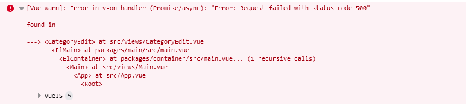
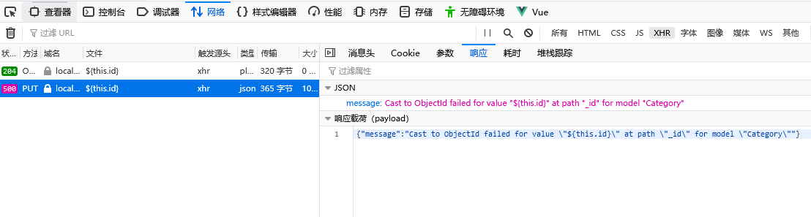
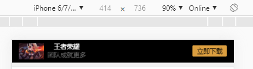
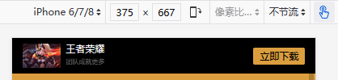
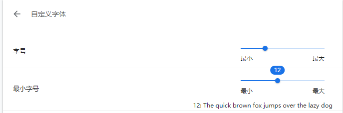
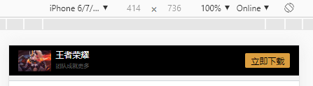
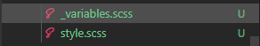

# node-vue-moba

## 安装所需依赖模块
```
npm install
```

## 运行
```
npm run serve
```

## 打包
```
npm run build
```


### 首先是安装node.js，因为这个项目要用到vue-cli3，vue-cli3是基于webpack搭建的，所以需要安装node9以上的环境

下面是安装node时踩得一部分坑和记录一下新学习到要用到的一些模块：<br>
 **1.** 之前安装npm的时候都是点默认安装，模块都装在c盘，看了网上的很多教程建议装到其他盘然后要把node_global、node_cache装到该目录下。
于是开始了一系列的XX模块不是内部命令的提示，就是环境变量配置的问题，经历了一个反复重装node、配环境变量的黑暗下午总算是搞定了，遇到这个问题的朋友可以看看这篇教程 https://blog.csdn.net/qq_36648555/article/details/78460648<br>
 
 **2.** 在创建项目的时候选了默认的模板，里面带了eslint，只要稍微有不规范就会报错，例如你定义了一个变量没有使用，就会一直给你报错，非常难受，起初我打算去eslint的配置文件修改它的规则，但是因为用的是3.0的脚手架，项目目录没有build和config文件夹，修改配置有点麻烦，所以我直接 npm uninstall 一顿操作把所有eslint相关的模块卸载了，斩草除根。（eslint虽然很烦，但是我相信存在即有理，我觉得等到编码水平达到一定程度的时候，再通过这个东东来规范自己的编码是非常有意义的）<br> <br>


**3.** 在写axios请求路径的时候，需要注意反单引号 ``  和 单引号  '' 的区别，以下举个例子（自己挖的坑） <br>

```JavaScript
async save(){
    let res
    if(this.id) {
        res = await this.$http.put('rest/categories/${this.id}', this.model)
    } else{
        res = await this.$http.post('rest/categories/', this.model)
    }
    this.$router.push('/categories/list')
    this.$message({
        type: 'success',
        message: '保存成功'
    })
},
```
上面写了一个分类新建、编辑的保存函数，在保存时就报错了

打开network查看请求

这里就可以看出来是请求路径的问题，百度一搜，果然是es6模板字符串的写法问题
```JavaScript
 res = await this.$http.put('rest/categories/${this.id}', this.model)
```
这里的put请求传递了一个变量，此时这个路径应该使用反引号``对变量进行字符串拼接，而不是用单引号改成如下写法，请求成功
```JavaScript
 res = await this.$http.put(`rest/categories/${this.id}`, this.model)
```
<br>

**4.** http-assert这个包非常方便 ，在后面使用jwt时会用到<br>
安装
```JavaScript
$ npm install http-assert  
```
用法如下
```JavaScript
assert(value, [status], [message], [properties])
```
总的来说就是确保值value存在？如果不存在抛出什么错误状态码status，message是什么，属性构造可省略
例子：
```JavaScript
var assert = require('http-assert')
var ok = require('assert')
 
var username = 'foobar' // username from request
 
try {
  assert(username === 'fjodor', 401, 'authentication failed')
} catch (err) {
  ok(err.status === 401)
  ok(err.message === 'authentication failed')
  ok(err.expose)
}
```
**5.** 安装bcrypt模块时报错
bcrypt，是一个跨平台的文件加密工具，用于装密码的散列，在建管理员账户模型时会用到。<br>
在安装这个模块时如果遇到报错、缺少XX模块、安装失败的话可以尝试安装bcryptjs。bcryptjs是纯js写的bcrypt，在JavaScript中优化了bcrypt，没有依赖关系。兼容C++bcrypt绑定到node.js，也可以在浏览器中工作。 
```JavaScript
$ npm install bcryptjs
```
[详细用法戳我](https://www.npmjs.com/package/bcryptjs)


**6.** MalformedJwtException：JWT格式错误异常
这个问题是在写请求拦截器时由于不熟练，忘了在Bearer的后面带一个空格，而在后续操作里提取token的时候又对' '分割后再进行提取token
```JavaScript
http.interceptors.request.use(function (config) {
    // Do something before request is sent
    if(localStorage.token){     //有token才写请求头
        config.headers.Authorization = 'Bearer' + localStorage.token 
    }
    return config;
  }, function (error) {
    // Do something with request error
    return Promise.reject(error);
  });

```
需要在Bearer后面
```JavaScript
 config.headers.Authorization = 'Bearer ' + localStorage.token //
```
总的来说，参考别人写的东西的时候的时候真的要细心观察，认真思考！！！加bearer的时候别忘了后面有个空格

**7.** 写scss时，某些样式在chrome不生效，换了浏览器Firefox生效
例如定义了一个字体大小为8px的样式，在谷歌浏览器里死活显示的是和12px的样式一样大
```html
    <div class="text-white fs-sm">王者荣耀</div>            //fs-sm = 12px
    <div class="text-grey-1 fs-xxs">团队成就更多</div>      //fs-xxs = 8px
```
Chrome里的显示效果如下<br>
<br>
起初以为是自己写样式时出了差错造成的，检查代码之后觉得自己没有写错，于是换了个浏览器试试效果<br>
在Firefox里是正常显示所要求的效果<br>
<br>
好了，现在的问题就是谷歌浏览器里是有设置显示最小字体大小的，那个数值恰好是12px，而在之前的版本里似乎这个最小字体大小是更改不了的，就需要写一些js判断用户是否在用chrome，如果是就应用自定义的样式去适应chrome手动更改字体大小。不过我们还是比较幸运的，因为Chrome在新版本解决了这个问题，在新版本的chrome里是可以将最小字体大小给取消的，嘻嘻。<br>
**打开设置=>外观=>自定义字体里，这个就是万恶之源**<br>
<br>
**将最小字号的大小拉到0就解决了**<br>
<br>
更改之后的效果<br>
<br>
感谢这位前辈的解决方案，有兴趣的朋友可以看看上古（其实也就是两年前的）方法怎么解决这个问题[传送门](https://blog.csdn.net/m0_37793545/article/details/74377309)


**8.** scss 变量和实现分离<br>
在web端项目文件夹下，将scss分成了两个文件，一个用来写样式变量，一个用于写样式的实现。
<br>
如下：<br> <br>
这样对于我们在编写页面时，很方便快捷的添加和使用需要频繁用到常用的样式如字体大小、背景颜色<br>
先在_variable.scss里写变量
```scss
//_variable.scss
//在这里我们定义了一些项目里需要用到的一些字体的size值，变量前需要使用'$'标志
//变量可以是一个组
$base-font-size:1rem;
$font-sizes: (
    xxs: 0.6154, //8px
    xs: 0.7692,  //10px
    sm: 0.9231,  //12px
    md: 1,          //13px
    lg: 1.0769,  //14px
    xl: 1.2308,  //16px
);
//后期需要补充其他大小，只需要往变量数组里面加就可以了
```
写完变量，我们去到style.scss里写实现
```scss
//首先需要在style.scss里引用变量文件
@import './variables';  //scss中被包含（被引用）的文件以'_'开头命名，引用的时候不需要'_'

//text
@each $sizeKey, $size in $font-sizes {      //表示往变量数组里取这一个key和对应的值
    .fs-#{$sizeKey}{                        //举个例子，当sizeKey=xxs时，这段表达式相当于  .fs-xxs{font-size: 0.6154*1rem}
        font-size: $size*$base-font-size;
    }
}
```
在html代码中我们就可以很方便使用这些字体样式，比如
```HTML
<span class="fs-xxs">i am not a span</span>        <!-- 只要在class里写写上对应的变量名 -->
<p class="fs-sm">i am not a p</p>     
```


**9.** Vue-Awesome-Swiper <br>
因为移动端首页需要用到轮播图，所以要用到这个组件。Vue-Awesome-Swiper基于 Swiper4、适用于 Vue 的轮播组件，支持服务端渲染和单页应用。在[npm.js](https://www.npmjs.com/package/vue-awesome-swiper) 可以找到这个包的详细介绍，我这里用到了这几个比较常用的参数设置，在html中写好swiper和swiper-slide标签基本就可以使用了，很方便。
```JavaScript
      swiperOption: {
        autoplay: true, //自动播放
        loop: true,     //循环播放
        speed: 400,     //切换图片速度毫秒
    },
```

**10.** sprite精灵（雪碧）图、字体图标 <br>
因为会用到雪碧图和文字图标，所以去了解了一下这两者的区别。  
首先我们来了解一下精灵图：精灵图也有人叫雪碧图，简单来说就是通过图像合并技术，将很多图标放到一张图上，使用的时候我们只需要通过一次请求得到整张精灵图，然后通过定位从精灵图中获取所需要的图标，这样做可以减少多次请求，减轻http请求的压力。通过定位获取图标比较常用的两个方法：1.使用Photoshop软件对精灵图里的图标进行定位  2.借助工具网站，例如 www.spritecow.com 就可以上传一张雪碧图，很轻松的就能获取精灵图定位。  
然后就是字体图标了：就是可以像字体一样使用的图标，可以使用字体相关的CSS属性来对它进行控制。阿里巴巴的字体图标库是必须mark下来的，非常方便 https://www.iconfont.cn/


chrome里的console里 使用 $$('')可以做选择器等于document.querySelectorAll（）

npm install require-all  这个插件：可以将某一个文件夹下的所有文件引用进来
schema中的虚拟属性方法相当于vue中的计算属性，它是通过已定义的schema属性的计算\组合\拼接得到的新的值
MongoDB的聚合查询,在一次查询里面用类似于mysql的关联或者更强大的方式同时执行好几条查询最终得到想要的结果<br>
```Javascript
const cats = await Category.aggregate([
    { $match: { parent: parent._id} },  
    { 
        $lookup: {
            from: 'articles',    //schema的集合名默认情况下是schema名字的小写复数形式
            localField: '_id',
            foreignField: 'categories',
            as: 'newsList'
        }
    }
])
```   
格式化时间可以使用这个包 dayjs
let's encrypt 免费证书，有效期只有三个月，每三个月就需要重新更换一次
